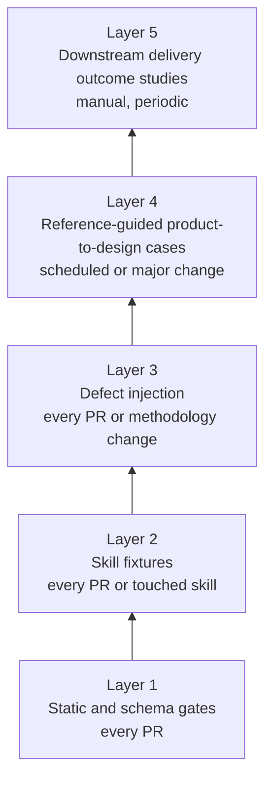
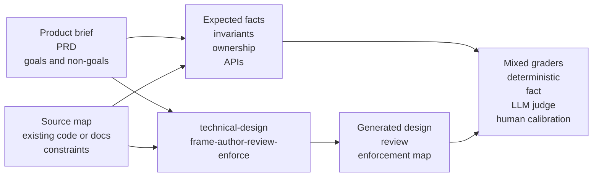
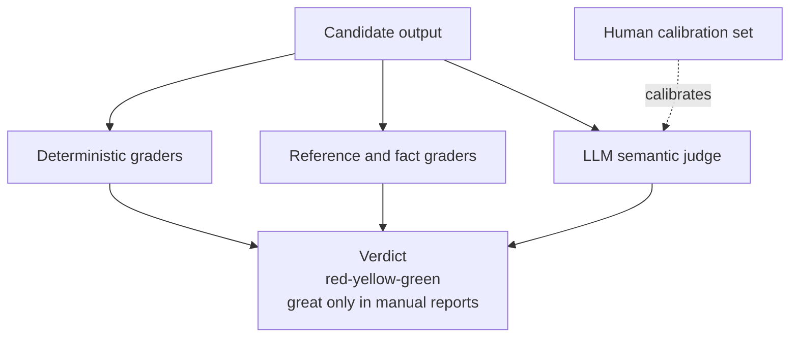
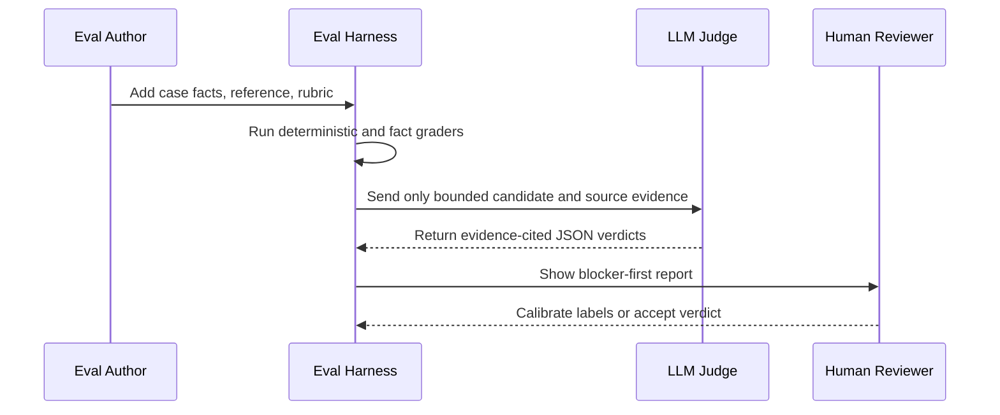

# Evaluation Strategy

This document defines how `technical-design` should be evaluated as a design-stage skills pack. It
is a design target, not a claim that every harness exists today. The current repository already has
static checks and enforceability fixtures under `evals/`; this strategy describes how those checks
grow into a layered evaluation system for design quality.

## Goal

Evaluate whether `technical-design` produces source-grounded, DDD-first, implementation-ready
technical designs from product or PRD input, and whether its review and enforcement skills catch the
defect classes that would otherwise create downstream delivery failures.

The evaluation system must answer four questions:

1. Did the pack preserve the product intent and source facts?
2. Did it model useful DDD boundaries, ownership, invariants, and language?
3. Did it avoid invented facts, unowned states, and unenforceable claims?
4. Would the output help a downstream planner or implementer without reconstructing the design?

## Why

Generic architecture quality is hard to grade by exact output matching. Two good designs can choose
different wording, boundaries, or tactical depth. A single LLM judge score is also too brittle for a
production gate. `technical-design` needs a mixed evaluation system that separates mechanical
contract checks from semantic design judgment.

The design principle is:

> Use deterministic graders for what can be proven, reference/fact graders for coverage and
> invention, LLM judges for semantic quality, and human calibration for trust in the judge.

## Non-Goals

- Do not treat one public reference design as the only correct answer.
- Do not use broad 1-10 scores as release gates.
- Do not allow an LLM judge verdict to override deterministic source or schema failures.
- Do not add private application names or private repository facts to eval fixtures.
- Do not require every eval case to exercise every skill.

## Evaluation Pyramid

Cheap, deterministic checks sit at the base. Expensive product-to-design case replays sit at the
top and run less often.



### Layer 1 - Static and Schema Gates

Layer 1 protects contracts that are cheap to verify:

- required skill/profile files exist;
- review suggestions match the suggestion schema;
- design templates expose the expected sections;
- fixture names stay generic and do not leak private source names;
- generated enforcement rules require seeded violations;
- no-boundary CRUD cases pass honestly with empty enforcement.

This layer is the natural extension of the current `scripts/check_eval_static.mjs` and
`scripts/run_enforce_eval.mjs` gates.

Current status: implemented and gated by `pnpm check` through static schema/fixture checks, skill and
profile checks, deterministic unit tests, and seeded enforcement evals.

### Layer 2 - Skill Fixtures

Layer 2 evaluates each skill in isolation with small fixtures:

| Skill         | Fixture Input                    | Expected Signal                                                  |
| ------------- | -------------------------------- | ---------------------------------------------------------------- |
| `frame`       | brief, source map, blockers      | source-grounded frame, only blocking questions                   |
| `author`      | accepted frame and product facts | DDD frontmatter, context ownership, invariants, enforcement map  |
| `review`      | defective design                 | structured suggestions with evidence, gate refs, and lesson refs |
| `enforce`     | layer map and seeded source tree | dependency rule fails on seed, passes honest no-boundary case    |
| `orchestrate` | requested stop point             | composes sibling skills without inventing methodology behavior   |

Layer 2 should prefer pass/fail expectations over prose quality scores.

Implemented first slice:

- `evals/fixtures/review/expected-suggestions.json` stores complete expected review suggestions and is
  validated against the review suggestion schema.
- `evals/fixtures/ddd/defect-manifest.json` declares the initial deterministic DDD defect classes, their
  expected catching surface, lesson reference, and exact review-rubric evidence. The manifest may
  grow as future Layer 3 classes move from target strategy to executable fixtures.
- `evals/hooks.mjs` validates fixtures inside the static check gate so malformed fixture
  expectations fail `pnpm check`.

Current status: implemented and gated for the committed review, DDD, planning, enforcement, and case
fixture contracts. Review suggestion fixtures use the current required `title`, `status`, and
`decision_ref` fields.

### Layer 3 - Defect Injection

Layer 3 seeds known failure classes and verifies that review or enforcement catches them:

- missing bounded context ownership;
- invented failure token, state, field, event, or public symbol;
- unsourced invariant operand;
- promised public API with no exposure proof;
- vacuous enforcement rule with no seeded violation;
- tactical DDD overuse on a strategic-only case;
- tactical DDD underuse for strict lifecycle or invariant cases.

Each injected defect must name the expected catching surface: static check, review rubric item,
enforcement seed, or LLM-judge criterion.

### Layer 4 - Reference-Guided Product-to-Design Cases

Layer 4 evaluates the full value proposition. It starts from product-side material and asks
`technical-design` to produce the design. The generated design is compared with a reference design
and a case-specific fact map.



Case inputs should include:

```text
evals/fixtures/cases/<case-id>/
  product.md
  source-map.md
  reference-design.md
  expected-facts.json
  expected-boundaries.json
  rubric.md
  grader-notes.md
```

Case outputs should include:

```text
evals/results/<run-id>/
  frame.md
  design.md
  review.md
  enforcement-map.md
  grades.json
  transcript.md
```

Reference designs are comparison anchors, not exact targets. A generated design can pass when it
preserves required facts and makes defensible alternative boundary choices.

Current status: seven self-contained cases are committed under `evals/fixtures/cases/`.
Their reference designs are intentionally compact anchors, not full canonical-template outputs. The
deterministic grader uses source-visible expected facts and boundaries, accepted alternatives, and
concept groups. Default boundary coverage requires local ownership evidence instead of scattered
context and noun mentions.

### Layer 5 - Downstream Outcome Studies

Layer 5 measures whether better design artifacts reduce downstream delivery cost:

- fewer planner clarifications;
- fewer implementation blockers from missing contracts;
- fewer review findings for ownership, invariants, or enforcement;
- clearer story slicing and test strategy;
- less rework after implementation begins.

This layer is expensive and should run manually or periodically, especially before changing
methodology behavior.

## Grading Model

The grade is a verdict assembled from multiple graders, not a single averaged score.



### Deterministic Graders

Deterministic graders own anything mechanically checkable:

- required files and sections;
- valid JSON schemas;
- declared `owns`, `reads`, and `does-not-own` fields;
- expected case facts and boundaries that cite visible `product.md` or `source-map.md` source refs;
- one seeded violation per generated enforcement rule;
- no-boundary cases that produce no fake rules;
- public API proof references where public APIs are claimed.

Any deterministic blocker makes the run red.

Deterministic text matching should be calibrated for source-equivalent wording. Graders may normalize
Markdown punctuation and use explicit accepted alternatives or concept groups, but contradiction
checks remain conservative and authoritative.

### Reference and Fact Graders

Reference/fact graders compare the candidate design with expected case facts:

- product goals and non-goals;
- required user workflows;
- owned entities, events, states, fields, and failure tokens;
- required invariants and both operands for relational predicates;
- required public APIs and exposure proof;
- required enforcement boundaries.

The grader should classify each fact as:

| Verdict        | Meaning                                                  |
| -------------- | -------------------------------------------------------- |
| `covered`      | Candidate preserves the fact or requirement.             |
| `contradicted` | Candidate conflicts with the source or reference fact.   |
| `invented`     | Candidate introduces an unsupported producer-owned fact. |
| `missing`      | Candidate omits a required fact.                         |
| `unknown`      | Evidence is insufficient to grade.                       |

`contradicted` and `invented` findings are blockers unless explicitly marked as acceptable
alternative design choices in the case rubric.

Expected facts and boundaries must be source-visible. A fixture must not require wording or product
scope that appears only in `reference-design.md`, `rubric.md`, or grader notes. Reference designs are
comparison anchors, not answer keys.

### LLM Semantic Judge

Use an LLM judge only where deterministic and fact graders cannot reasonably decide:

- coherence of bounded contexts;
- fit of DDD depth to the complexity drivers;
- usefulness of tradeoffs and alternatives;
- clarity for downstream planning and implementation;
- whether the design preserves product intent without overfitting to the reference.

The judge must grade against a rubric and cite evidence. It must be allowed to return `unknown`.
It must not reward length, rhetorical confidence, or familiar architecture vocabulary without
source support.

Run pointwise coverage judging before pairwise comparison when inspecting generated case outputs.
The pointwise judge grades each expected `FACT-*` and `CTX-*` item against candidate evidence and
visible source inputs. Pairwise judging answers which candidate is better overall; it does not prove
that every required item is satisfied.

Minimum judge output:

```json
{
  "criterion": "bounded_context_ownership",
  "verdict": "pass",
  "severity": "critical",
  "evidence": [
    "design.md#bounded-contexts",
    "expected-boundaries.json#billing"
  ],
  "explanation": "The Billing context owns invoice lifecycle decisions and reads account status.",
  "confidence": "medium"
}
```

### Pairwise Regression Judge

For major skill or methodology changes, run pairwise comparisons:

- current pack output versus previous pack output;
- current pack output versus raw model baseline;
- current pack output versus reference design.

Pairwise judging should randomize order and ask which candidate is more source-grounded,
implementation-ready, and enforceable. The judge must explain the winning criteria, not only pick
a winner.

If deterministic grading and pointwise judging disagree, record the disagreement as calibration
evidence. Do not let an LLM judge override deterministic blockers until a human-reviewed calibration
set shows acceptable false-pass and false-fail behavior.

### Human Calibration

Keep a small golden set of human-reviewed cases. The LLM judge is trusted only when it agrees with
human labels on blocker detection and broad verdicts at an acceptable rate.

Calibration should track:

- false passes on invented facts;
- false failures on defensible alternative designs;
- position bias in pairwise judging;
- preference for verbosity over clarity;
- over-reliance on reference design wording.

## Verdicts

Use gate-oriented verdicts instead of average scores:

| Verdict  | Meaning                                                                                                                                                                                      |
| -------- | -------------------------------------------------------------------------------------------------------------------------------------------------------------------------------------------- |
| `red`    | Any hard blocker exists.                                                                                                                                                                     |
| `yellow` | No blocker, but the run does not meet the green bar: less than 90 percent of critical criteria pass or less than 70 percent of recommended criteria pass.                                    |
| `green`  | No blocker, at least 90 percent of critical criteria pass, and at least 70 percent of recommended criteria pass.                                                                             |
| `great`  | Manual/report-level only: green and wins calibrated pairwise comparison against the raw-model baseline or prior pack output. Deterministic `eval:case` does not currently emit this verdict. |

Hard blockers:

- invented producer-owned field, event, state, failure token, or public API;
- missing product-critical requirement;
- blurred bounded context ownership;
- invariant without sourced operands;
- enforcement claim without a seeded gate;
- design output that cannot drive implementation planning.

Critical criteria:

- source grounding;
- product coverage;
- context ownership;
- invariant closure;
- public exposure clarity;
- failure and consistency handling;
- enforcement map quality;
- delivery readiness.

Recommended criteria:

- tradeoff clarity;
- observability;
- migration and deploy concerns;
- testing split across runtime, type, static, and manual proof;
- DDD ceremony fit.

## Case Portfolio

The initial portfolio should stay small enough to maintain:

| Case Type                                  | Count | Purpose                                                                 |
| ------------------------------------------ | ----: | ----------------------------------------------------------------------- |
| Tiny contract fixture                      |     2 | Fast regression on required output shape.                               |
| Seeded defect fixture                      |     2 | Prove review catches known failure classes.                             |
| Snapshotted public proposal/reference case |     2 | Exercise product-to-design comparison.                                  |
| DDD-heavy reference case                   |     1 | Exercise ownership, invariants, context boundaries, and tactical depth. |
| Negative fit case                          |     1 | Prove the pack can recommend strategic-only or low-ceremony design.     |

Public samples should prefer artifacts with stable product intent, goals, non-goals, proposal
details, rollout/test concerns, and an existing reference design. Infrastructure RFCs and
improvement proposals are useful for product-to-design comparison. DDD reference applications are
useful for boundary and ownership comparison, but often need supplementary product briefs.

Case selection rules:

- Source and reference material used by a case must be committed or snapshotted under
  `evals/fixtures/cases/<case-id>/`; evals must not depend on live external fetches.
- Case IDs and fixture names must stay generic even when source material came from a public project.
- Each case should include provenance and license notes when source material is derived from a
  public artifact.
- Expected facts and expected boundaries must be maintained as separate grader inputs rather than
  inferred from reference-design prose at grading time.
- Large public artifacts should be reduced to bounded excerpts that preserve the product/design
  facts under test.

## Requirements

Functional requirements:

- The eval harness must support independent runs for `frame`, `author`, `review`, `enforce`, and
  `orchestrate`.
- Each case must declare expected facts and boundaries separate from the reference design prose.
- Graders must produce machine-readable results.
- LLM-judge prompts must require evidence citations and allow `unknown`.
- Pairwise comparisons must randomize candidate order.
- Verdict aggregation must preserve blocker severity and must not average blockers away.
- Fixture naming must remain generic and must not expose private application names.

Non-functional requirements:

- Eval cases must be small enough to debug when a single criterion fails.
- Results must be reproducible enough to compare across pack revisions.
- Semantic judges must be versioned by prompt, model, and rubric.
- The system must distinguish current implemented gates from future target gates.
- Reviewer-facing reports must summarize failures before summaries or recommendations.

## Verification Plan

1. Keep `pnpm check` as the required repository gate.
2. Add static checks when a new case format is introduced.
3. Add at least one deliberately failing fixture for every deterministic rule.
4. Run a first golden-set pass manually before trusting any LLM-judge verdict.
5. Re-run pairwise regression cases before changing methodology templates, review rubrics, or
   orchestration behavior.
6. Review eval failures as design signals first; only relax rubrics after confirming the expected
   case fact is wrong or too narrow.

## Reviewer Workflow



## Open Decisions

- Exact machine-readable schema for `expected-facts.json`.
- Minimum agreement threshold between human labels and LLM-judge verdicts.
- Whether periodic Layer 4 and Layer 5 runs should publish committed summaries or local-only
  evidence bundles.

## References

- [OpenAI evaluation guidance](https://developers.openai.com/api/docs/guides/evaluation-best-practices):
  use task-specific graders, combine automated and human review, and prefer clear criteria over
  vague aggregate scores.
- [Anthropic evaluation guidance](https://www.anthropic.com/engineering/demystifying-evals-for-ai-agents):
  calibrate LLM judges, allow uncertainty, and validate evaluator behavior against human judgment.
- [LangSmith evaluation guidance](https://docs.langchain.com/langsmith/evaluation-concepts): use
  reference outputs and pairwise comparison when exact matching is too brittle.
- [SEI ATAM guidance](https://www.sei.cmu.edu/library/architecture-tradeoff-analysis-method-collection/):
  evaluate architecture through quality attributes, business drivers, and tradeoffs rather than
  diagram similarity.

These references inform the strategy. They are not runtime dependencies, and eval cases must remain
self-contained after their inputs are snapshotted into the repository.
