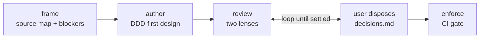

# Flows

The `technical-design` pack runs one design lifecycle with five stable skills. Methodology-specific
behavior comes from the active profile; v1 uses `methodologies/ddd/`.

## Flow A - Full Design

Use when starting from a brief, PRD, technical notes, or enough session context.

1. `frame` reads source artifacts and current technical surfaces before asking questions.
2. `frame` records a source map, safe assumptions, blockers, DDD context candidates, complexity
   drivers, and initial `ddd_depth`.
3. `author` writes a technical-solution-compatible design using the active DDD profile.
4. `review` emits architecture/enforceability and domain-correctness suggestions.
5. The user disposes each suggestion. Decisions are appended to `decisions.md`.
6. `author` applies accepted decisions in update mode.
7. `enforce` turns the settled enforcement map into TS-first boundary rules and seeded violation
   checks.

## Flow B - In-Session Task

Use when the user asks for a smaller design inside an active coding session.

1. Lightweight `frame` reads the local source surfaces that define the touched area.
2. It asks only questions that would change ownership, boundaries, persistence, consistency, or
   testing.
3. `author` emits a focused DDD-first design update or explains why the existing design already
   covers the task.
4. `review` and `enforce` run only for changed boundaries or new domain behavior.

## Flow C - Existing Design Review

Use when a draft already exists.

1. `review` reads the design, methodology profile, decisions log, and source artifacts it cites.
2. It grades with two lenses: architecture/enforceability and domain correctness.
3. The user disposes suggestions; accepted items route to `author` update mode.
4. Re-review continues until no blocking suggestion is open.

## Flow D - Orchestrated

`orchestrate-technical-design` is a composition-only runbook. It reads and applies the four sibling
skills in sequence, pauses for human dispositions, and stops exactly at the requested boundary:
`frame`, `author`, `review`, or `enforce`.
