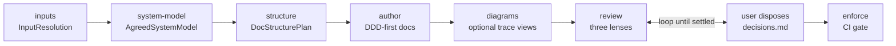

# Flows

The `technical-design` pack runs one design lifecycle with five stable skills. Methodology-specific
behavior comes from the active profile; v1 uses `methodologies/ddd/`. The lifecycle optimizes for
preventing premature design commitment: source-grounded inputs, approved system model, approved docs
structure, then durable design docs.

## Flow A - Full Design

Use when starting from a brief, PRD, technical notes, or enough session context.

1. `frame` reads source artifacts and current technical surfaces before asking questions.
2. `frame` produces `InputResolution`, classifying required inputs as `provided`,
   `safe assumption`, `requires approval`, or `blocked`.
3. `frame` produces `AgreedSystemModel`: high-level entities, responsibilities, relations,
   ownership, seams, lifecycle/state terms, open questions, `architecture_mode`, initial
   `ddd_depth`, and approval status. The flow stops until required approvals are settled.
4. `author` produces `DocStructurePlan`: proposed docs tree, responsibility of each file,
   excluded content, per-file status, and approval status.
5. `author` writes durable design docs only after the system model and docs structure are approved.
6. `author` adds diagrams only when they explain approved entities, flows, lifecycles, or
   boundaries; diagrams must not introduce architecture.
7. `review` emits architecture/enforceability, domain-correctness, and agreement-integrity
   suggestions.
8. The user disposes each suggestion. Decisions are appended to `decisions.md`.
9. `author` applies accepted decisions in update mode.
10. `enforce` turns the settled enforcement map into TS-first boundary rules and seeded violation
   checks.

## Flow B - In-Session Task

Use when the user asks for a smaller design inside an active coding session.

1. Lightweight `frame` reads the local source surfaces that define the touched area.
2. It resolves only inputs that would change ownership, boundaries, persistence, consistency,
   delivery slicing, or testing.
3. It records a focused system model delta and whether approval is required before docs change.
4. `author` updates the docs structure or emits a focused DDD-first design update only after the
   model delta is approved.
5. `review` and `enforce` run only for changed boundaries or new domain behavior.

## Flow C - Existing Design Review

Use when a draft already exists.

1. `review` reads the design, methodology profile, decisions log, and source artifacts it cites.
2. It grades with three lenses: architecture/enforceability, domain correctness, and
   agreement integrity.
3. The user disposes suggestions; accepted items route to `author` update mode.
4. Re-review continues until no blocking suggestion is open.

## Flow D - Orchestrated

`orchestrate-technical-design` is a composition-only runbook. It reads and applies the four sibling
skills in sequence, pauses for human approvals and dispositions, and stops exactly at the requested
boundary: `inputs`, `system-model`, `structure`, `author`, `diagrams`, `review`, or `enforce`.
