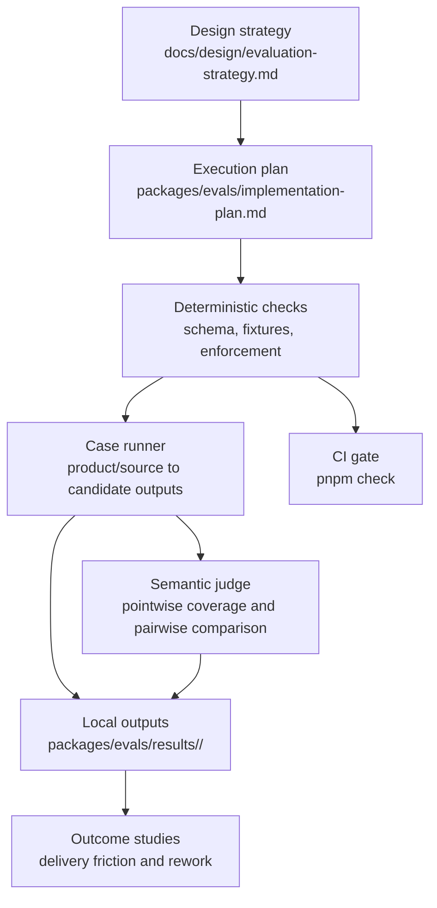

# Evaluation Implementation Plan

This plan executes the design in
[`docs/design/evaluation-strategy.md`](../docs/design/evaluation-strategy.md) while keeping eval
code, scripts, fixtures, usage docs, and local outputs under `packages/evals/`.

The implementation should advance from deterministic checks to semantic judging only after the
lower layers are explicit, reproducible, and reviewable.

## Current Status

| Phase                                  | Status  | Result                                                                                  |
| -------------------------------------- | ------- | --------------------------------------------------------------------------------------- |
| 0. Strategy and scope                  | Done    | Evaluation strategy added and linked from eval docs.                                    |
| 1. Deterministic fixture contracts     | Done    | Review expectations and DDD defect fixtures are validated in `pnpm check`.              |
| 2. Schema-backed deterministic harness | Done    | Ajv schemas and Vitest validator tests are wired into `pnpm check`.                     |
| 3. Product-to-design case runner       | Done    | Seven self-contained deterministic cases and local result runner are available.         |
| 3.5. Case grader calibration           | Done    | Source-visible expectations, calibrated text matching, local ownership evidence, and pointwise judging are covered. |
| 4. LLM judge and pairwise regression   | Scaffolded | Manual judge rubrics, output schemas, and Promptfoo template exist outside the gate. |
| 5. Outcome studies                     | Scaffolded | Redacted outcome-study template and schema exist for future manual studies.          |

## Execution Flow



## Phase 0 - Strategy and Scope

Status: Done.

Implemented:

- Added the layered evaluation strategy.
- Defined the evaluation pyramid, mixed grading model, verdict semantics, case selection rules, and
  verification plan.
- Clarified that public/reference cases must be snapshotted and self-contained.

Agents and review:

- Main agent authored the strategy.
- Independent reviewer checked for scope gaps and diagram/readability issues.
- PR review caught and fixed the verdict-ladder gap.

Verification:

- `pnpm check`
- Mermaid render sanity check.
- GitHub `check` on PR #4.

## Phase 1 - Deterministic Fixture Contracts

Status: Done.

Implemented:

- Added `packages/evals/src/validate_eval_fixtures.mjs`.
- Added `fixtures/ddd/defect-manifest.json`.
- Expanded `fixtures/review/expected-suggestions.json` to complete review suggestion objects.
- Wired fixture validation into `packages/evals/src/run_static_checks.sh`.
- Documented the implemented slice in `evals/README.md` and the strategy.

Agents and review:

- Research sidecar mapped existing eval/check surfaces.
- Architecture sidecar recommended the first coherent implementation slice and pushed back on
  premature fact grading.
- Reviewer sidecar found the public API severity mismatch with the rubric.
- Reviewer sidecar found that the manifest language incorrectly implied complete Layer 3 coverage.
- Main agent patched both findings and reran verification.

Verification:

- `node packages/evals/src/validate_eval_fixtures.mjs`
- `pnpm check`
- Independent narrow rechecks of the fixed findings.
- GitHub `check` on PR #4.

## Phase 2 - Schema-Backed Deterministic Harness

Status: Done.

Goal:

Move from custom structural checks toward reusable, standard validation and test outputs without
changing behavior.

Recommended OSS tools:

- Use `ajv` for JSON Schema validation of manifests, expected suggestions, expected facts, expected
  boundaries, and grader outputs. Ajv supports JSON Schema drafts through 2020-12 and avoids
  hand-written object validation for stable schemas.
- Use `vitest` for deterministic unit tests around verdict aggregation, fact classification, and
  validator edge cases. Vitest has built-in reporters, including machine-readable formats suitable
  for CI.
- Keep `dependency-cruiser` for architecture enforcement because it already powers the enforce eval
  and its rule model directly matches the design-owned enforcement maps.

Implemented:

- Added JSON Schemas under `schemas/`.
- Replaced hand-coded structural validation in `validate_eval_fixtures.mjs` with Ajv validation while
  retaining cross-file semantic checks.
- Added Vitest tests under `packages/evals/tests/` for missing required DDD defect, empty rubric reference,
  severity mismatch, unknown lesson id, and fixture path escaping `fixtures/ddd/`.
- Added `eval:unit` and wired it into `pnpm check`.
- Kept generated test reports out of committed files.

Agents and review:

- Implementer: schema/test migration with write scope limited to `evals/**` and package metadata if
  a dependency is added.
- Reviewer: compare generated validation failures against the current validator behavior.
- Architect: review whether schemas are stable enough before applying them to product-to-design
  cases.

Integration point:

- `pnpm check` must still be the required repository gate.
- Dependency additions must be justified by deleted custom validation code or durable output
  support.

Verification:

- `pnpm install --frozen-lockfile`
- `node packages/evals/src/validate_eval_fixtures.mjs`
- `pnpm check`
- Deliberately break one copied fixture locally to confirm the validator fails with a clear message,
  then discard the local break.

## Phase 3 - Product-to-Design Case Runner

Status: Done.

Goal:

Add self-contained Layer 4 cases without relying on live external fetches or private product names.

Recommended OSS tools:

- Use `promptfoo` for model-driven case replay when prompts/providers enter the harness. It supports
  YAML configuration, assertions, CI usage, and JSON/HTML/JUnit result exports. Keep Promptfoo
  optional until the repo has a stable case format and provider/key policy.
- Keep deterministic fact extraction and comparison in local code or schemas before introducing
  model-graded assertions.

Implemented:

- Added `fixtures/cases/README.md` with case authoring rules and fixture licensing requirements.
- Added the initial synthetic, self-contained product-to-design case and later calibrated the
  committed case set to seven cases: `case-aerial-delivery-shipping-v1`,
  `case-cloudevents-core-contract-v1`, `case-customer-credit-order-saga-v1`,
  `case-fineract-loan-lifecycle-v1`, `case-kubernetes-sidecar-containers-v1`,
  `case-openfeature-evaluation-api-v1`, and `case-tiny-laundry-pickup-v1`.
- Added schemas for expected facts, expected boundaries, grades, and result manifests.
- Added `packages/evals/src/run_case_eval.mjs`, which reads a candidate design and writes `manifest.json`,
  `grades.json`, `report.md`, and per-case grader evidence under ignored `packages/evals/results/<run-id>/`.

Agents and review:

- Researcher: identify candidate public artifacts and licensing/provenance constraints.
- Architect: approve the case format before adding multiple cases.
- Implementer: add runner and current public case fixtures without introducing private product
  names.
- Reviewer: inspect whether expected facts are source-grounded and not inferred from reference prose.

Integration point:

- Deterministic tiny cases can join `pnpm check`.
- Expensive product-to-design replays should be a separate manual or scheduled command until runtime,
  cost, and flake risk are understood.

Verification:

- `pnpm check`
- `node <case-runner> --case <case-id> --candidate <candidate-design>`
- Inspect `packages/evals/results/<run-id>/<case-id>/report.md` before accepting fixture changes.

## Phase 3.5 - Case Grader Calibration

Status: Done.

Goal:

Keep deterministic product-to-design grading precise without turning reference anchors or exact
wording into hidden product requirements.

Implemented:

- Calibrated deterministic text matching for Markdown punctuation and source-equivalent wording.
- Tightened default boundary matching so context names and owned nouns must appear in the same local
  candidate segment unless the fixture declares explicit accepted alternatives or concept groups.
- Added fact-level accepted alternatives and concept groups to match boundary-grader behavior.
- Added fixture validation that expected facts and boundaries cite `SRC-*` IDs visible in
  `product.md` or `source-map.md`.
- Calibrated the current product-to-design cases against known false blockers from the initial
  three-case pilot and the public case expansion.
- Accounted for the staged approval flow by validating that the author contract requires
  `InputResolution`, `AgreedSystemModel`, and `DocStructurePlan`, while keeping current compact
  reference designs as comparison anchors rather than requiring them to reproduce every canonical
  template section.
- Accounted for the canonical DDD template change by treating
  `skills/author-technical-design/templates/design-doc.md` as an alias and checking only
  compatibility markers there; the canonical body stays in
  `methodologies/ddd/templates/technical-design.md`.
- Added a manual pointwise judge to grade expected `FACT-*` and `CTX-*` items before pairwise
  comparison.
- Updated the authoring contract so source-named aggregates and service candidates receive explicit
  ownership treatment or an internal sub-boundary decision.

Agents and review:

- Architect: review schema and grader contract.
- Implementer: update deterministic grader, schemas, fixtures, and tests.
- Implementer: add pointwise judge schema, Promptfoo prompt, runner, and report support.
- Reviewer: inspect source grounding, hidden-reference leakage, judge bias, and CI gating.

Integration point:

- `pnpm check` remains deterministic-only.
- Pointwise and pairwise judge runs remain manual and advisory until human calibration exists.
- Deterministic/judge disagreement is recorded as calibration evidence, not as a release pass.

Verification:

- `pnpm --filter @agentic-workflow-kit/technical-design-evals eval:unit`
- `node packages/evals/src/validate_eval_fixtures.mjs`
- deterministic `eval:case` runs for all committed reference designs
- optional manual pointwise judge run with local Codex auth

Ongoing enhancements:

- Regenerate the aerial delivery candidate after `SRC-013` is visible in `product.md` and
  `source-map.md`; older generated artifacts cannot prove that newly visible non-goal.
- Build a small human-labeled pointwise calibration packet before treating model coverage judgments
  as release signals.
- Keep pairwise comparison secondary to deterministic and pointwise coverage results; use pairwise
  only for relative quality once blockers are understood.

## Phase 4 - LLM Judge and Pairwise Regression

Status: Scaffolded.

Goal:

Use LLM judges only for semantic criteria that deterministic graders cannot decide.

Recommended OSS tools:

- Prefer Promptfoo first for this repo because it is Node/CLI/YAML friendly and can emit JSON, HTML,
  and JUnit outputs.
- Consider DeepEval only if the eval stack moves toward Python/pytest or needs its ready-made
  G-Eval and agent/RAG metrics.
- Consider Langfuse or Phoenix later if the project needs shared trace storage, datasets,
  experiments, annotation queues, or production observability. Those are platforms, not just a
  lightweight repo-local harness.
- Do not build on OpenAI's hosted Evals API for new work because the Evals platform is deprecated.

Implemented:

- Added judge rubrics under `packages/evals/promptfoo/judges/`.
- Added a pairwise comparison prompt that requires randomized candidate order to be recorded.
- Added schemas for structured judge output and pairwise results.
- Added a manual Promptfoo template outside the required PR gate.

Remaining:

- Calibrate on a small human-reviewed set before using judge verdicts as a release signal.

Agents and review:

- Architect: approve judge rubric boundaries and unknown-handling rules.
- Reviewer: adversarially inspect judge prompts for verbosity bias, position bias, and reference
  overfitting.
- Implementer: wire runner and output parsing.
- Human reviewer: label the golden calibration set.

Integration point:

- Judge runs should not block every PR until calibration demonstrates acceptable false-pass and
  false-fail behavior.
- Pairwise regression should run before methodology template, rubric, or orchestrator behavior
  changes.

Verification:

- Deterministic JSON parse and schema validation of every judge result.
- Pairwise order randomization proof in run metadata.
- Human calibration agreement report under `packages/evals/results/<run-id>/`.

## Phase 5 - Outcome Studies

Status: Scaffolded.

Goal:

Measure whether better design artifacts reduce delivery friction.

Implemented:

- Added `fixtures/outcomes/README.md` with outcome-study rules.
- Added `fixtures/outcomes/outcome-study-template.json`.
- Added `schemas/outcome-study.schema.json`.

Remaining:

- Pick completed design-to-implementation runs and record downstream signals.
- Compare runs before and after eval improvements.
- Store raw evidence outside committed fixtures unless the repo explicitly accepts a redacted
  summary.

Agents and review:

- Researcher: collect run evidence and redact private details.
- Reviewer: classify failure modes against the lessons ledger.
- Architect: decide which failures should become new deterministic fixtures or judge criteria.

Integration point:

- Outcome studies should inform new fixtures; they should not directly rewrite rubrics without a
  source-grounded defect class.

Verification:

- Human review of classifications.
- New or updated fixture added for every recurring defect class promoted into the pack.

## Output Conventions

Generated outputs belong under `packages/evals/results/<run-id>/`.

Committed by default:

- fixture inputs;
- schemas;
- runner source;
- small expected outputs used as test fixtures;
- redacted summary reports when explicitly reviewed.

Ignored by default:

- full run transcripts;
- raw model outputs;
- local HTML reports;
- provider logs;
- temporary result bundles.

Every result bundle should include:

```text
packages/evals/results/<run-id>/
  manifest.json
  report.md
  grades.json
  cases/<case-id>/
    candidate.md
    grader-output.json
```

`manifest.json` should record command, git commit, case ids, tool versions, model/provider metadata
when applicable, and whether the run is deterministic or model-graded.

Deterministic case reports emit red/yellow/green only. `great` is a manual/report-level verdict for
green runs that also win calibrated pairwise comparison; it is not emitted by `eval:case`.

## OSS Tooling Decision Log

| Tool               | Use When                                                                                              | Do Not Use When                                                            | Decision                                                             |
| ------------------ | ----------------------------------------------------------------------------------------------------- | -------------------------------------------------------------------------- | -------------------------------------------------------------------- |
| Ajv                | Validating JSON fixtures and grader outputs against committed schemas.                                | A check depends on semantic reading of prose.                              | Adopt in Phase 2 if schemas grow beyond the current small validator. |
| Vitest             | Unit-testing deterministic validators, fact graders, verdict aggregation, and output writers.         | The repo still has only shell/static checks and no reusable logic to test. | Adopt with Phase 2 if it replaces ad hoc manual edge-case checks.    |
| dependency-cruiser | Enforcing generated architecture boundaries with seeded violations.                                   | Grading design semantics or product facts.                                 | Keep; already implemented.                                           |
| Promptfoo          | Running prompt/model evals, assertions, LLM rubrics, CI exports, and HTML/JSON/JUnit reports.         | Deterministic schema and fixture validation are enough.                    | Preferred Phase 4 runner for model-graded evals.                     |
| DeepEval           | Python/pytest-based LLM tests or ready-made agent/RAG metrics become important.                       | The repo remains Node-first and wants YAML/CLI model evals.                | Keep as secondary option.                                            |
| Langfuse           | Shared observability, datasets, experiments, annotation, and online/offline eval tracking are needed. | The need is only repo-local CI evals.                                      | Consider for Phase 5 or cross-repo observability, not now.           |
| Phoenix            | OpenTelemetry-based tracing plus datasets/experiments/evals are needed.                               | The need is only lightweight file-based evals.                             | Consider alongside Langfuse for Phase 5/platform work, not now.      |
| OpenAI Evals API   | Existing content must be exported before shutdown.                                                    | Starting new eval infrastructure.                                          | Avoid for new work because the platform is deprecated.               |

## Source Notes

- [OpenAI deprecations](https://developers.openai.com/api/docs/deprecations) and
  [OpenAI Evals guide](https://developers.openai.com/api/docs/guides/evals): hosted Evals becomes
  read-only on October 31, 2026 and shuts down on November 30, 2026.
- [OpenAI migration cookbook](https://developers.openai.com/cookbook/examples/evaluation/moving-from-openai-evals-to-promptfoo):
  OpenAI recommends Promptfoo for continuing Evals workflows.
- [Promptfoo output formats](https://www.promptfoo.dev/docs/configuration/outputs/),
  [Promptfoo CI/CD](https://www.promptfoo.dev/docs/integrations/ci-cd/), and
  [Promptfoo CLI](https://www.promptfoo.dev/docs/usage/command-line/): CLI evals with
  JSON/JSONL/YAML/HTML/XML/JUnit outputs for local and CI runs.
- [Ajv](https://ajv.js.org/) and
  [Ajv schema-language docs](https://ajv.js.org/guide/schema-language.html): JSON Schema and JTD
  validation with draft 2019-09 and 2020-12 support.
- [Vitest reporters](https://vitest.dev/guide/reporters) and
  [Vitest outputFile](https://vitest.dev/config/outputfile): machine-readable JSON/HTML/JUnit test
  reports.
- [DeepEval quickstart](https://deepeval.com/docs/getting-started),
  [DeepEval datasets](https://deepeval.com/docs/evaluation-datasets), and
  [DeepEval G-Eval](https://deepeval.com/docs/metrics-llm-evals): Python/pytest-style LLM evals and
  custom LLM-as-judge metrics.
- [Langfuse overview](https://langfuse.com/docs),
  [Langfuse evaluation overview](https://langfuse.com/docs/evaluation/overview), and
  [Langfuse datasets](https://langfuse.com/docs/evaluation/experiments/datasets): open-source LLM
  engineering platform with traces, datasets, experiments, and evals.
- [Phoenix eval docs](https://arize.com/docs/phoenix/evaluation/llm-evals) and
  [Phoenix LLM-as-judge concepts](https://arize.com/docs/phoenix/evaluation/concepts-evals/llm-as-a-judge):
  OpenTelemetry-backed evaluator runs, datasets, experiments, and LLM-as-judge support.
