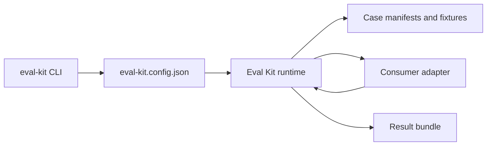

# Eval Kit

`@agentic-workflow-kit/eval-kit` is a portable runner package for local evaluation suites. It is
currently a private workspace package inside `technical-design`, but it is written as a standalone
kit that can later move to a shared repository.

The kit owns reusable mechanics:

- command routing for deterministic and model-assisted eval runs;
- config loading and path containment;
- case manifest discovery;
- JSON Schema registration and validation;
- result manifest and artifact records;
- Promptfoo execution helpers and bundled prompt templates;
- generic text coverage helpers and verdict aggregation.

The consuming repository owns domain semantics:

- eval cases and fixture files;
- graders and reporters;
- Promptfoo variable resolution adapter exports;
- domain schemas and fixture validation;
- rubrics and human interpretation.

## Status

Current supported surfaces:

- `run-case` deterministic grading through consumer-provided grader and reporter modules;
- `validate-fixtures` manifest validation plus optional consumer fixture validation;
- `generate` Promptfoo generation using the bundled generation prompt or a consumer override;
- `judge-coverage` pointwise Promptfoo judging using the bundled pointwise prompt;
- `report` combined manual report assembly through a consumer hook;
- result manifests using `eval-kit.result-manifest.v2`;
- schema and path helper APIs exported from `src/index.mjs`.

Known implementation follow-ups before publishing this as a fully generic shared package:

- several portable schemas still reflect the first `technical-design` consumer shape;
- pairwise judging needs prompt/schema/result alignment before it should be treated as stable;
- provider support is intentionally narrow: `openai` and `openai:codex-app-server`;
- model-assisted commands require local Codex auth and Promptfoo installed in the consumer repo.

## Package Layout

```text
packages/eval-kit/
  bin/eval-kit.mjs                  # executable entry point
  src/
    cli.mjs                         # command parser and command dispatch
    config.mjs                      # config loading, schema roots, hook loading
    paths.mjs                       # safe path/id helpers
    schema.mjs                      # Ajv 2020 schema registry
    artifacts.mjs                   # artifact records and result manifests
    promptfoo.mjs                   # Promptfoo execution and output parsing
    grading.mjs                     # generic normalized text coverage helpers
    verdict.mjs                     # generic verdict aggregation
    sdk.mjs                         # command implementations
    index.mjs                       # public exports
  schemas/                          # bundled schemas
  promptfoo/
    generation.prompt.md            # default generation prompt
    judges/
      pointwise.prompt.md           # default pointwise judge prompt
      pairwise.prompt.md            # default pairwise prompt, not yet stable
  tests/                            # package unit tests
```

Companion docs:

- [Adapter Contract](./docs/adapter-contract.md)
- [Schemas](./docs/schemas.md)
- [Examples](./docs/examples.md)

## Core Design

Eval Kit has two boundaries.

The kit boundary is generic infrastructure. It can load a suite, resolve a case, execute a command,
validate outputs, and write a result bundle. It must not import consumer content directly.

The suite boundary is domain-specific interpretation. A suite decides what a case means, what
artifacts are visible to a model, how a candidate is graded, and how reports should read.

At runtime, the kit loads `eval-kit.config.json`, resolves the suite root and result root, registers
the bundled schemas plus suite schema roots, then dynamically imports suite modules declared in the
config.



## Installation

Today, the package is consumed as a workspace dependency:

```json
{
  "devDependencies": {
    "@agentic-workflow-kit/eval-kit": "workspace:*"
  }
}
```

The package exposes:

```json
{
  "bin": {
    "eval-kit": "./bin/eval-kit.mjs"
  },
  "exports": {
    ".": "./src/index.mjs"
  }
}
```

For model-assisted commands, the consuming repository also needs:

- `promptfoo` available at `node_modules/.bin/promptfoo`;
- local Codex auth available through `codex login status`;
- the suite adapter exports required by the chosen command.

## Minimal Consumer Layout

```text
evals/
  eval-kit.config.json
  adapter.mjs
  cases/
    case-example-v1/
      case-manifest.json
      product.md
      expected-facts.json
      expected-boundaries.json
      rubric.md
      reference-design.md
  results/
    README.md
```

The paths above are conventions, not requirements. The config decides the suite root, result root,
case discovery, method settings, and adapter module.

## Configuration

A typical consumer config:

```json
{
  "$schema": "../packages/eval-kit/schemas/eval-kit.config.schema.json",
  "schema_version": "eval-kit.config.v1",
  "suite_id": "technical-design",
  "suite_root": ".",
  "results_root": "results",
  "adapter": "adapter.mjs",
  "cases": {
    "root": "cases",
    "include": ["case-*-v1"]
  },
  "methods": {
    "deterministic": {
      "enabled": true,
      "grader": "facts-boundaries",
      "reporter": "markdown"
    },
    "generate": {
      "enabled": true,
      "prompt": "@eval-kit/generation"
    },
    "judge_coverage": {
      "enabled": true,
      "prompt": "@eval-kit/pointwise",
      "rubric": "case:rubric.md"
    },
    "judge_pairwise": {
      "enabled": false
    },
    "report": {
      "enabled": true
    }
  }
}
```

Path behavior:

- the config file path is resolved from the current working directory;
- `suite_root`, `results_root`, and relative adapter paths resolve from the config directory;
- `cases.root` resolves from `suite_root`;
- `cases.include` and `cases.exclude` match immediate case directory names with `*` wildcards;
- suite and result paths must stay contained by the detected repository root;
- run ids and case ids are treated as ids, not paths.

Prompt behavior:

- `prompt_templates.generation` overrides the bundled generation prompt;
- `prompt_templates.pointwise_judge` overrides the bundled pointwise prompt;
- `prompt_templates.pairwise_judge` overrides the bundled pairwise prompt.

If a prompt template is omitted, the kit uses its bundled prompt.

Legacy configs that declare `case_manifests`, `graders`, `reporters`, `hooks`, and `schema_roots`
are still accepted for compatibility, but new suites should prefer `adapter`, `cases`, and
`methods`.

## Case Manifests

Each case manifest must include `schema_version`, `case_id`, and `artifacts`. Additional
consumer-specific fields are allowed.

```json
{
  "schema_version": "technical-design.case-manifest.v1",
  "case_id": "case-tiny-laundry-pickup-v1",
  "case_type": "tiny_contract",
  "artifacts": [
    { "role": "generation_visible", "path": "product.md" },
    { "role": "grader_input", "path": "expected-facts.json" },
    { "role": "grader_input", "path": "expected-boundaries.json" },
    { "role": "semantic_reference", "path": "reference-design.md" }
  ],
  "grading": {
    "grader": "technical-design-facts-boundaries"
  }
}
```

Artifact paths are relative to the manifest directory and must exist. The kit adds
`absolutePath` when returning resolved artifacts to adapter and SDK functions.

## CLI

The binary is `eval-kit`.

In the current `technical-design` consumer, root scripts wrap the binary:

```bash
pnpm eval:case -- --case case-tiny-laundry-pickup-v1 --candidate evals/cases/case-tiny-laundry-pickup-v1/reference-design.md
pnpm eval:generate -- --case case-tiny-laundry-pickup-v1 --model gpt-5.4 --provider openai --effort medium --run-id tiny-generate
pnpm eval:judge:coverage -- --case case-tiny-laundry-pickup-v1 --candidate evals/results/tiny-generate/cases/case-tiny-laundry-pickup-v1/candidate.md --model gpt-5.4 --provider openai --effort medium
pnpm eval:manual-report -- --run-id tiny-report --deterministic tiny-deterministic --judge-coverage tiny-pointwise
```

Direct binary usage:

```bash
eval-kit run-case \
  --config evals/eval-kit.config.json \
  --case case-tiny-laundry-pickup-v1 \
  --candidate evals/cases/case-tiny-laundry-pickup-v1/reference-design.md \
  --run-id verify-tiny-reference
```

### Commands

`run-case`

Deterministically grades one candidate file. It loads the configured grader and reporter, writes a
result bundle, and exits non-zero when the verdict is `red`.

Required:

- `--case <id>`
- `--candidate <path>`

Optional:

- `--run-id <id>`
- `--config <path>`

`generate`

Runs Promptfoo through the Codex App Server provider and writes a generated candidate.

Required:

- `--case <id>`
- `--model <name>`
- `--provider <openai|openai:codex-app-server>`
- `--effort <low|medium|high>`
- `--run-id <id>`

Optional:

- `--config <path>`

`judge-coverage`

Runs a pointwise model judge over expected items and a candidate.

Required:

- `--case <id>`
- `--candidate <path>`
- `--model <name>`
- `--provider <openai|openai:codex-app-server>`
- `--effort <low|medium|high>`

Optional:

- `--run-id <id>`
- `--config <path>`

`judge-pairwise`

Compares two candidates with randomized order. This command exists, but it should be treated as
unstable until pairwise prompt and result schemas are reconciled.

`report`

Combines existing run bundles into one manual report through the consumer `compileReport` hook.

Required:

- `--run-id <id>`

Optional parent runs:

- `--generate <id>`
- `--deterministic <id>`
- `--judge-coverage <id>`
- `--judge <id>`
- `--outcome <id>`
- `--config <path>`

`validate-fixtures`

Validates discovered case manifests and then calls `adapter.validateFixtures`, if present.

## Adapter Contract

The kit loads the suite adapter from config. A single `adapter.mjs` can implement all roles. Legacy
configs may still split graders and reporters into separate modules.

Deterministic grading expects a grader export named one of:

- `gradeTechnicalDesignCandidate`
- `gradeCandidate`
- `default`

The grader receives:

```js
{
  candidateText,
  ...graderInputs
}
```

`graderInputs` are built from artifacts with role `grader_input`; JSON file names become camelCase
keys. For example, `expected-facts.json` becomes `expectedFacts`.

The grader returns:

```js
{
  verdict: "green",
  findings: []
}
```

Reporting expects a reporter export named one of:

- `renderDeterministicReport`
- `renderReport`
- `default`

Promptfoo and manual-report commands expect named hook exports. See
[Adapter Contract](./docs/adapter-contract.md) for the complete hook signatures.

## Result Bundles

Every command writes into:

```text
<results_root>/<run-id>/
  manifest.json
  report.md
  ...command-specific artifacts
```

The current v2 manifest shape is:

```json
{
  "schema_version": "eval-kit.result-manifest.v2",
  "run_id": "verify-tiny-reference",
  "run_type": "deterministic",
  "runner": {
    "id": "technical-design-eval-case",
    "version": "0.0.0"
  },
  "case_ids": ["case-tiny-laundry-pickup-v1"],
  "started_at": "2026-07-01T00:00:00.000Z",
  "ended_at": "2026-07-01T00:00:01.000Z",
  "duration_ms": 1000,
  "status": "completed",
  "git": {
    "commit": "abc123"
  },
  "command": "eval-kit run-case ...",
  "tool_versions": {
    "node": "v26.0.0"
  },
  "artifacts": [],
  "output_files": ["manifest.json", "report.md"]
}
```

Artifacts include path, media type, byte size, SHA-256, encoding, and redaction status.

## Public API

The package exports these helpers from `@agentic-workflow-kit/eval-kit`:

- args: `defaultRunId`, `parseArgs`, `requireArg`
- paths: `assertContainedPath`, `assertSafeId`, `containsPath`, `createPathResolver`,
  `toPosixPath`
- schemas: `createSchemaRegistry`, `validateWithSchema`
- artifacts: `artifactRecord`, `normalizeLegacyManifest`, `sha256File`, `writeManifest`,
  `writeResultBundle`
- Promptfoo: `extractPromptfooOutput`, `parseJsonOutput`, `runPromptfooRaw`
- verdicts: `aggregateVerdict`, `criticalBlockerCount`
- config: `loadConfig`
- grading helpers: `normalize`, `candidateSegments`, `includesAny`, `includesAll`,
  `assessCoverage`, `gradeFacts`
- SDK commands: `resolveCaseManifest`, `discoverCaseIds`, `runCase`, `generateCandidate`,
  `judgeCoverage`, `judgePairwise`, `compileReport`, `validateFixtures`

## Verification

Package tests:

```bash
pnpm --filter @agentic-workflow-kit/eval-kit test
```

In this repository, the full gate is:

```bash
pnpm check
```

Manual deterministic smoke:

```bash
pnpm eval:case -- --case case-tiny-laundry-pickup-v1 --candidate evals/cases/case-tiny-laundry-pickup-v1/reference-design.md --run-id verify-tiny-reference
```

Expected report headline:

```text
Verdict: green
Blocker findings: 0
```
