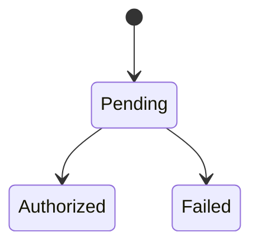

# Technical Design - Payment Authorization

## 1. Planner Handoff Summary

### Handoff Identity

| Field | Value |
|---|---|
| Design ID | `payment-authorization` |
| Handoff contract | `technical-design-handoff-v0` |
| Design title | Payment Authorization |
| Status | Settled, ready for planning |
| Architecture mode | `lifecycle/state-machine` |
| Methodology profile | `ddd@1`, `tactical-ddd` depth |
| Review round | 2 |

### Source and Product References

| ID | Type | Reference | Required for Planning | Notes |
|---|---|---|---|---|
| SRC-001 | brief | Payment authorization brief | Core workflow, gateway constraints, idempotency, and provider isolation requirements. | Example fixture source. |
| SRC-002 | decision | `D-004` | Event sourcing is deferred until replay or audit requirements exceed gateway plus audit table history. | Deferred decision. |
| SRC-003 | design | `problem-frame.md` | Approved InputResolution, AgreedSystemModel, and DocStructurePlan for payment authorization. | Example approval source. |

### Required Planning Facts

| ID | Category | Required handoff data | Source/fact refs |
|---|---|---|---|
| CTX-001 | Context and boundary | Payment Authorization owns authorization state, idempotency decisions, and failure tokens. It reads order total and customer payment method reference, and does not own order fulfillment or provider settlement. | SRC-001 |
| INV-001 | Invariant and lifecycle | Payment attempts authorize only from pending state. Operands: `PaymentAttempt.status` and `AuthorizePayment` command. | SRC-001 |
| INV-002 | Invariant and lifecycle | Idempotency key is single-writer. Operands: `command.idempotencyKey` and `stored attempt.idempotencyKey`. | SRC-001 |
| SURF-001 | API and surface | `PaymentGatewayPort` is produced by Payment Authorization and isolates provider authorization behind a domain/application port with contract tests. | SRC-001 |
| SURF-002 | API and surface | `PaymentAttemptRepository` is the persistence port produced by Payment Authorization; domain code must not import infrastructure adapters. | SRC-001 |
| FAIL-001 | Failure | Payment Authorization owns gateway timeout, duplicate attempt, and invalid transition tokens including `payment-state-invalid` and `duplicate-payment-attempt`. | SRC-001 |
| OBS-001 | Observability | Payment Authorization emits `payment_authorization_requested`, `payment_authorization_completed`, and `payment_authorization_failed`. | SRC-001 |
| ENF-001 | Enforcement | Static import rule `no-domain-to-infrastructure` includes a seeded violation at `src/domain/__architecture__/domain-imports-infrastructure.seed.ts`. | SRC-001 |
| DEL-001 | Delivery planning | Story candidate: implement PaymentAttempt aggregate and owned failure tokens before adapters. Preserves `INV-001`, `INV-002`, and `FAIL-001`. | SRC-001 |
| DEL-002 | Delivery planning | Story candidate: add gateway and repository ports plus contract tests. Preserves `SURF-001` and `SURF-002`. | SRC-001 |
| DEL-003 | Delivery planning | Story candidate: add infrastructure adapters and architecture gate seed after domain ports exist. Preserves `ENF-001`. | SRC-001 |

### Sequencing, Contention, Validation, and Stops

| ID | Category | Required handoff data | Source/fact refs |
|---|---|---|---|
| SEQ-001 | Sequencing and dependency | `DEL-001` must precede `DEL-002`; `DEL-002` must precede `DEL-003`. Do not parallelize adapter work before ports and aggregate tests land. | DEL-001, DEL-002, DEL-003 |
| FILE-001 | File contention | Public domain index and architecture config are shared surfaces; serialize changes that touch exports or dependency rules. | ENF-001 |
| VAL-001 | Validation | Expected evidence: runtime aggregate unit tests, gateway port contract tests, static `check:architecture`, and the seeded dependency violation failure. | INV-001, INV-002, SURF-001, ENF-001 |
| STOP-001 | Stop condition | Stop if settlement or fulfillment behavior is pulled into this context. | CTX-001 |
| STOP-002 | Stop condition | Stop if replay or audit requirements make event sourcing necessary, because `D-004` deferred that choice. | SRC-002 |

### Methodology-Specific Detail

- **Required handoff data:** the tables above.
- **DDD-specific authoring detail:** the context map, tactical invariant model, ports, enforcement
  map, and delivery inputs below explain the DDD reasoning behind the handoff.

## 2. Pre-Authoring Approval Record

### InputResolution

**InputResolution approval status:** approved

| Required input | Source evidence | Resolution | Owner / impact | Approval status |
|---|---|---|---|---|
| authorization lifecycle owner | SRC-001 | provided | Payment Authorization owns attempt state transitions | approved |
| idempotency key authority | SRC-001 | provided | Payment Authorization owns duplicate-attempt decision | approved |
| event sourcing need | SRC-002 | safe assumption | deferred until replay or audit needs justify it | approved |

### AgreedSystemModel

**AgreedSystemModel approval status:** approved

| Entity | Responsibilities | Owns | Reads | Does Not Own |
|---|---|---|---|---|
| Payment Authorization | authorize attempts, guard state transitions, own failure tokens | authorization state, idempotency decisions | order total, customer payment method reference | fulfillment, provider settlement |
| Gateway Adapter | translate provider authorization calls | provider request/response mapping | PaymentGatewayPort command | authorization state |
| Repository Adapter | persist attempts | storage mapping | PaymentAttemptRepository port | lifecycle decisions |

| From | Relation | To | Notes |
|---|---|---|---|
| Payment Authorization | calls | PaymentGatewayPort | provider SDK stays outside domain |
| Payment Authorization | calls | PaymentAttemptRepository | repository port preserves domain-owned lifecycle decisions |

### DocStructurePlan

**DocStructurePlan approval status:** approved

| File | Responsibility | Status |
|---|---|---|
| `technical-design.md` | design overview, lifecycle model, enforcement map, and planning handoff | contract |
| `decisions.md` | review dispositions and deferred event-sourcing decision | decision-log |

**Structure approval status:** approved

## 3. Source and Context Audit

| Source | Used for | Notes |
|---|---|---|
| Payment authorization brief | core workflow and gateway constraints | Requires idempotency and external provider isolation. |

## 4. Assumptions and Blockers

### Safe Assumptions
- Gateway responses are retriable when the provider reports timeout or unknown status.

### Blocking Questions
- None.

## 5. Architecture Mode and DDD Depth

**Selected architecture_mode:** lifecycle/state-machine

**Selected depth:** tactical-ddd

**Why this mode is the first lens:** Authorization correctness depends on who owns prior state,
transition authority, duplicate handling, and failure tokens.

**Why this depth is sufficient:** Payment authorization has strict lifecycle transitions,
idempotency, external provider language, and failure tokens consumed by downstream contexts.

**Where deeper tactical ceremony is unnecessary:** Event sourcing is not required because the payment
gateway and audit table provide enough history for v1.

## 6. Context Map

| Context | Owns | Reads | Does Not Own |
|---|---|---|---|
| Payment Authorization | authorization state, idempotency decisions, failure tokens | order total, customer payment method reference | order fulfillment, provider settlement |

## 7. Ubiquitous Language

| Term | Meaning | Owner |
|---|---|---|
| Authorization | Provider-approved hold on funds before capture | Payment Authorization |
| PaymentAttempt | One idempotent attempt to authorize a payment | Payment Authorization |

## 8. Domain Behavior

| Command / Use Case | Actor | Invariant guarded | Result |
|---|---|---|---|
| Authorize payment | checkout flow | pending attempt can authorize at most once per idempotency key | Authorized or Failed attempt |

## 9. Invariant and State Matrix

| Invariant / Predicate | Source operands | Enforced by | Failure token |
|---|---|---|---|
| attempt authorizes only from pending | PaymentAttempt.status, AuthorizePayment command | PaymentAttempt aggregate | payment-state-invalid |
| idempotency key is single-writer | command.idempotencyKey, stored attempt.idempotencyKey | authorization repository port | duplicate-payment-attempt |

## 10. Ports, Adapters, and Public API

| Surface | Type | Owner | Consumers | Enforcement |
|---|---|---|---|---|
| PaymentGatewayPort | domain/application port | Payment Authorization | provider adapter | port contract test |
| PaymentAttemptRepository | repository port | Payment Authorization | infrastructure adapter | no-domain-to-infrastructure |

## 11. Source and Producer Closure

| Produced obligation | Producer/source authority | Consumers | Closure proof |
|---|---|---|---|
| `PaymentGatewayPort` | Payment Authorization from SRC-001 | provider adapter | port contract test |
| `PaymentAttemptRepository` | Payment Authorization from SRC-001 | repository adapter | port contract test and import-boundary rule |
| `payment-state-invalid`, `duplicate-payment-attempt` | Payment Authorization failure-token catalog from SRC-001 | checkout flow, route handler, observability mapper | aggregate unit tests |
| payment authorization audit events | Payment Authorization observability requirements from SRC-001 | operations dashboards and logs | runtime event tests |

## 12. Data, Query, and Consistency

- **Write model:** PaymentAttempt aggregate is the transaction boundary.
- **Read model:** status projection reads committed attempts.
- **Consistency:** strong for attempt state, eventual for analytics.

## 13. Failure, Observability, Migration, and Deploy

- **Failure modes:** gateway timeout, duplicate attempt, invalid transition.
- **Observability:** payment_authorization_requested, payment_authorization_completed,
  payment_authorization_failed.
- **Migration/deploy:** add payment_attempts table and idempotency key index.

## 14. Diagrams



The diagram only shows approved lifecycle states from `AgreedSystemModel`.

## 15. Testing and Enforcement

| Claim | Proof substrate | Proof | Standing gate |
|---|---|---|---|
| domain never imports infrastructure | static rule plus seeded negative | seeded dependency violation | check:architecture |
| invalid transition fails closed | runtime test | aggregate unit test | test |

### Enforcement Map

```json
{
  "layers": [
    { "name": "domain", "path": "src/domain" },
    { "name": "infrastructure", "path": "src/infrastructure" }
  ],
  "forbidden": [
    {
      "from": "domain",
      "to": "infrastructure",
      "reason": "Payment domain must depend on ports, not concrete persistence or provider SDKs.",
      "seededViolation": "src/domain/__architecture__/domain-imports-infrastructure.seed.ts"
    }
  ]
}
```

## 16. Delivery Inputs

- **Candidate story areas:** aggregate and tokens, gateway port, repository adapter, architecture gate.
- **Sequencing constraints:** aggregate and failure token catalog before adapters.
- **File contention:** public domain index and architecture config.
- **Validation expectations:** unit tests, contract tests, check:architecture.
- **Stop conditions:** stop if settlement or fulfillment behavior is pulled into this context.

## 17. Risks and Deferred Decisions

- D-004 deferred event sourcing until replay/audit requirements exceed the gateway plus audit table.
