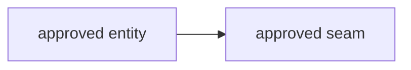

# Technical Design - <design name>

## 1. Planner Handoff Summary

This section is the methodology-neutral contract Planning consumes. DDD sections below may contain
deeper reasoning, but required planning facts must be summarized here with stable IDs and source refs.

### Handoff Identity

| Field | Value |
|---|---|
| Design ID | `<matches frontmatter design_id>` |
| Handoff contract | `technical-design-handoff-v0` |
| Design title | `<design name>` |
| Status | `<draft / reviewed / approved / superseded>` |
| Architecture mode | `<architecture_mode>` |
| Methodology profile | `ddd@1`, `<ddd_depth>` depth |
| Review round | `1` |

### Source and Product References

| ID | Type | Reference | Required for Planning | Notes |
|---|---|---|---|---|
| SRC-001 | <prd / brief / issue / source / design / decision> | <path, URL, or stable artifact reference> | <fact, constraint, or product intent Planning must preserve> | <notes> |
| SRC-002 | design | <InputResolution / AgreedSystemModel / DocStructurePlan reference> | Preserve approved input, model, and docs-structure decisions. | <approval notes> |

### Required Planning Facts

| ID | Category | Required handoff data | Source refs |
|---|---|---|---|
| CTX-001 | Context and boundary | <ownership, reads, does-not-own, and dependency direction> | <SRC-*> |
| INV-001 | Invariant and lifecycle | <guarded predicate/state transition, source operands, owning authority> | <SRC-*> |
| SURF-001 | API and surface | <public API, port, adapter, event, command, data, or integration surface> | <SRC-*> |
| FAIL-001 | Failure | <failure mode, token, degraded behavior, retry, or recovery authority> | <SRC-*> |
| OBS-001 | Observability | <event, metric, log, audit, or trace record> | <SRC-*> |
| ENF-001 | Enforcement | <test, static rule, seeded violation, manual gate, or manual-only rationale> | <SRC-*> |
| DEL-001 | Delivery planning | <candidate story area, boundary, expected outcome, facts preserved> | <SRC-*> |

### Sequencing, Contention, Validation, and Stops

| ID | Category | Required handoff data | Source refs |
|---|---|---|---|
| SEQ-001 | Sequencing and dependency | <producer-before-consumer constraints, dependencies, parallelism, ordering risks> | <DEL-* / SRC-*> |
| FILE-001 | File contention | <shared files, generated artifacts, migrations, or None with rationale> | <SRC-*> |
| VAL-001 | Validation | <commands, checks, review gates, seed expectations, and evidence> | <ENF-* / SRC-*> |
| STOP-001 | Stop condition | <condition that returns work to owner/design before implementation proceeds> | <CTX-* / INV-* / SRC-*> |

### Methodology-Specific Detail

- **Required handoff data:** the tables above.
- **DDD-specific authoring detail:** context maps, ubiquitous language, tactical model choices,
  invariant matrices, and ports/adapters below. Planning may read them for context but must not need
  to infer missing handoff facts from them.

## 2. Pre-Authoring Approval Record

### InputResolution

| Required input | Source evidence | Resolution | Owner / impact | Approval status |
|---|---|---|---|---|
| <ownership, invariant, lifecycle, API, data, failure, observability, enforcement, or delivery input> | <SRC-* or missing> | <provided / safe assumption / requires approval / blocked> | <context, fact ID, or blocking question> | <approved / pending / blocked / not required> |

### AgreedSystemModel

| Entity | Responsibilities | Owns | Reads | Does Not Own |
|---|---|---|---|---|
| <entity> | <responsibilities> | <facts, decisions, data, behavior> | <external facts consumed> | <nearby concerns owned elsewhere> |

| From | Relation | To | Notes |
|---|---|---|---|
| <entity> | <reads/calls/emits/configures/runs> | <entity> | <direction and constraints> |

### DocStructurePlan

| File | Responsibility | Status |
|---|---|---|
| <technical-design.md> | <overview / contract / lifecycle / enforcement / decision log / archive responsibility> | <overview / stub / contract / decision-log / archive> |

**Structure approval status:** <approved / pending / blocked>

## 3. Source and Context Audit

| Source | Used for | Notes |
|---|---|---|
| <PRD / brief / source file> | <requirements, existing behavior, constraints> | <notes> |

## 4. Assumptions and Blockers

### Safe Assumptions
- <assumption and why it is safe>

### Blocking Questions
- <question that would change ownership, boundaries, data, consistency, deploy, security, or tests>

## 5. Architecture Mode and DDD Depth

**Selected architecture_mode:** <system-entity-model | lifecycle/state-machine | ports-and-adapters | control-plane/runtime | contract/seam design | strategic-ddd | tactical-ddd>

**Selected depth:** <strategic-only | use-case-slices | ports-and-adapters | tactical-ddd>

**Why this mode is the first lens:** <rationale>

**Why this depth is sufficient:** <rationale>

**Where deeper tactical ceremony is unnecessary:** <rationale>

## 6. Context Map

| Context | Owns | Reads | Does Not Own |
|---|---|---|---|
| <context> | <facts, decisions, data, behavior> | <external facts consumed> | <nearby concerns owned elsewhere> |

## 7. Ubiquitous Language

| Term | Meaning | Owner |
|---|---|---|
| <term> | <precise meaning> | <context> |

## 8. Domain Behavior

Use `use-case-slice.md` for detailed slices.

| Command / Use Case | Actor | Invariant guarded | Result |
|---|---|---|---|
| <command> | <actor/system> | <invariant> | <state/event/output> |

## 9. Invariant and State Matrix

| Invariant / Predicate | Source operands | Enforced by | Failure token |
|---|---|---|---|
| <rule> | <declared fields/events/projections> | <context/aggregate/service> | <token> |

## 10. Ports, Adapters, and Public API

| Surface | Type | Owner | Consumers | Enforcement |
|---|---|---|---|---|
| <port/API/export> | <domain port/public export/adapter> | <context> | <consumers> | <import test/rule/manual> |

## 11. Data, Query, and Consistency

- **Write model:** <transaction boundary, idempotency, concurrency>
- **Read model:** <queries, projections, freshness>
- **Consistency:** <strong/eventual/manual reconciliation>

## 12. Failure, Observability, Migration, and Deploy

- **Failure modes:** <dependency failures, degraded states, fail-closed behavior>
- **Observability:** <events, metrics, logs, audit records>
- **Migration/deploy:** <schema/data/config/rollout/rollback impacts>

## 13. Diagrams

Add Mermaid diagrams only when they explain approved entities, flows, lifecycles, or boundaries.
Diagrams must not introduce architecture without a decision-log entry.



## 14. Testing and Enforcement

| Claim | Proof | Standing gate |
|---|---|---|
| <boundary/invariant/public API> | <test/fixture/static rule> | <command or CI lane> |

### Enforcement Map

```json
{
  "layers": [],
  "forbidden": []
}
```

## 15. Delivery Inputs

- **Candidate story areas:** <list>
- **Sequencing constraints:** <producer before consumer constraints>
- **File contention:** <shared files or none>
- **Validation expectations:** <commands/gates>
- **Stop conditions:** <when implementation should stop and return to design>

## 16. Risks and Deferred Decisions

- <risk, deferred suggestion, or accepted tradeoff with decision id>
